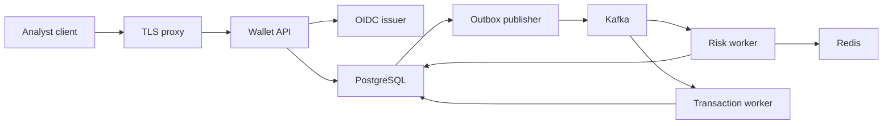

# Intelligent Wallet Ledger threat model

## Executive summary

The highest-value assets are ledger integrity and the authority to approve a review
case. This repository already places useful controls around those paths: a verified
OIDC analyst principal, serializable PostgreSQL transactions, immutable postings, and
an outbox/inbox delivery boundary. The largest residual risks are deployment-owned:
trusting the OIDC issuer and its network path, exposing a per-process rate limit to
public traffic, and protecting PostgreSQL, Kafka, and environment configuration from
operators or workloads outside this repository.

## Scope and assumptions

In scope: the Go runtime binaries, HTTP analyst-review command, PostgreSQL, Kafka,
Redis velocity observation, OIDC integration, configuration, and GitHub Actions.
Tests, Docker Compose, and demo credentials are evidence for behavior but are not a
production deployment design. AI provider credentials and a future transfer-creation
HTTP API are out of scope because no such runtime path is enabled here.

Assumptions used because deployment context was not supplied:

- `wallet-api` is internet reachable behind a TLS-terminating reverse proxy.
- This is a single-tenant portfolio deployment carrying test data, not production PII.
- PostgreSQL, Kafka, Redis, OIDC issuer settings, and environment variables are
  operator-controlled and not directly writable by a remote caller.
- The OIDC issuer is intentionally trusted for the configured audience and role claim.

Changing any assumption can change priorities materially, especially a multi-tenant
or real-money deployment, direct public exposure without a proxy, or a compromised
operator environment.

## System model

### Primary components

- `wallet-api` exposes health, metrics, and an optional analyst decision endpoint
  ([`cmd/wallet-api/main.go`](../cmd/wallet-api/main.go),
  `internal/app/walletapi.Run`).
- The review decision handler validates Bearer syntax, delegates OIDC authentication,
  requires the `analyst` role, limits each verified subject, and strictly decodes a
  4 KiB JSON body (`internal/adapter/http/reviewdecision.Handler`).
- PostgreSQL stores transfer lifecycle, immutable ledger, audit records, consumer
  inboxes, and outbox events (`docs/architecture.md`).
- The outbox publisher and Kafka workers provide at-least-once delivery; consumer
  inbox reservation makes a committed duplicate a no-op
  (`docs/adr/0007-transactional-outbox-delivery.md`).
- Redis supplies an ephemeral source-account velocity observation; a Redis failure
  becomes an auditable review outcome (`docs/adr/0010-redis-source-account-velocity.md`).

### Data flows and trust boundaries

- Internet -> reverse proxy -> `wallet-api`: HTTP headers and a Bearer token cross a
  network boundary. TLS, request-size limits, and coarse network limits are deployment
  responsibilities; the process enforces a 64 KiB header limit
  (`internal/platform/httpserver.New`).
- `wallet-api` -> configured OIDC issuer: discovery and JWKS verification cross an
  outbound HTTPS boundary. The application verifies issuer, audience, `sub`, and a
  configured role claim (`internal/identity/oidc.Authenticator`).
- `wallet-api` -> PostgreSQL: a trusted principal, transfer ID, decision, audit record,
  lifecycle transition, and outbox event cross a database credential boundary. The
  command commits these durable effects atomically (`docs/architecture.md`).
- PostgreSQL outbox -> Kafka -> workers -> PostgreSQL: versioned event envelopes cross
  the broker boundary. Kafka is at least once; inbox keys and transactional state
  changes enforce durable idempotency (`docs/architecture.md`).
- risk worker -> Redis: source-account and transfer identifiers cross a cache boundary;
  bounded timeouts and fail-safe review control Redis unavailability
  (`internal/risk/redis.NewObserver`, ADR-0010).

#### Diagram

## Assets and security objectives

| Asset | Why it matters | Security objective |
| --- | --- | --- |
| Immutable ledger, balances, lifecycle | Incorrect posting or completion can cause a false financial record. | Integrity, availability |
| Analyst decision authority | An approved review can release a transfer for posting. | Integrity, confidentiality |
| OIDC and database credentials | These grant access to authorization or durable state. | Confidentiality, integrity |
| Kafka events and inbox/outbox state | Lost, forged, or poisoned events can delay or distort workflow progression. | Integrity, availability |
| Audit records and logs | They support accountability and incident investigation. | Integrity, confidentiality |
| CI source and build dependencies | Compromise can ship code that bypasses runtime controls. | Integrity |

## Attacker model

### Capabilities

- A remote caller can send arbitrary HTTP requests and malformed JSON to a publicly
  exposed `wallet-api`.
- An authenticated user can present a token from the trusted issuer, but cannot invent
  the `analyst` role without an issuer-side authorization failure.
- A Kafka producer or network peer can cause malformed or duplicate messages if broker
  credentials or network segmentation are weak.
- A supply-chain attacker may exploit an unpinned CI action or compromised dependency.

### Non-capabilities

- A remote caller is not assumed to hold PostgreSQL, Kafka, Redis, or deployment
  environment credentials.
- A remote caller is not assumed to compromise the configured OIDC issuer.
- No tenant-isolation claim is made: this model assumes one operator-controlled tenant.

## Entry points and attack surfaces

| Surface | How reached | Trust boundary | Notes | Evidence |
| --- | --- | --- | --- | --- |
| Analyst decision | `POST /v1/transfers/{transferID}/review-decision` | Client -> API | OIDC, role check, 4 KiB JSON limit, per-process subject limiter. | `internal/adapter/http/reviewdecision.Handler` |
| Operational endpoints | `GET /healthz`, `/readyz`, `/metrics` | Client -> API | Metrics use bounded labels; deployment must decide exposure policy. | `internal/platform/httpserver.Handler` |
| OIDC discovery/JWKS | configured issuer URL | API -> issuer | Availability and trust depend on issuer configuration and network egress. | `internal/identity/oidc.New` |
| Kafka consumers | configured broker/topic | Kafka -> workers | Malformed or unknown events fail closed; no poison-event quarantine is implemented. | ADR-0007, `internal/app/riskworker.Run` |
| Process environment | service deployment | Operator -> process | Database, broker, Redis, policy, and OIDC endpoints are configuration inputs. | `internal/app/walletapi.ConfigFromEnv` |
| CI workflows | GitHub push/PR | Source -> CI | CodeQL, govulncheck, test, lint, Helm, and k6 run; third-party actions are pinned to reviewed commit SHAs. | `.github/workflows/*.yml` |

## Top abuse paths

1. An attacker obtains an `analyst` token from a compromised issuer account, submits an
   approval, and causes a durable lifecycle/audit/outbox transition that later reaches
   the transaction worker.
2. A bot distributes review requests across subjects or API replicas, bypassing the
   in-process limiter and consuming OIDC, database, and worker capacity.
3. An attacker with broker-network access produces malformed or unsupported events;
   workers fail closed and may accumulate consumer lag without a quarantine route.
4. An attacker with deployment configuration access points `OIDC_ISSUER` at an
   unintended issuer or steals database/broker credentials, bypassing remote caller
   controls entirely.
5. A compromised CI action or dependency alters source/build output before the runtime
   safeguards are deployed.
6. An operator exposes `/metrics` or logs to an untrusted audience, enabling operational
   reconnaissance or leaking data added by a future instrumentation change.

## Threat model table

| Threat ID | Threat source | Prerequisites | Threat action | Impact | Impacted assets | Existing controls (evidence) | Gaps | Recommended mitigations | Detection ideas | Likelihood | Impact severity | Priority |
| --- | --- | --- | --- | --- | --- | --- | --- | --- | --- | --- | --- | --- |
| TM-001 | Compromised analyst or issuer | Valid token with `analyst` role, or compromised issuer authorization. | Approve a review case to release posting. | Incorrect transfer completion. | Ledger, lifecycle, audit. | Issuer/audience verification, nonempty subject, role check, audit transaction (`internal/identity/oidc.Authenticate`, `reviewdecision.Handler`). | One broad role; no case assignment, MFA, or step-up control in this repo. | Require issuer MFA and group governance; add case ownership or dual approval before real-money use. | Alert on unusual approvals per subject, amount, or geography; review immutable audit records. | Low | High | medium |
| TM-002 | Remote bot | Public API access. | Flood requests across subjects or replicas. | OIDC/DB exhaustion and delayed analyst operations. | API availability, database. | 64 KiB headers, 4 KiB body, per-subject process limiter (`httpserver.New`, `decodeDecision`). | No proxy limit, global quota, concurrency cap, or per-IP limit; limiter resets per process. | Enforce edge rate/concurrency limits; restrict endpoint to private analyst network; use a shared limiter before scaling. | Proxy 429/5xx, OIDC latency, DB pool saturation, request-rate metrics. | Medium | Medium | medium |
| TM-003 | Broker peer or compromised integration | Kafka access or weak broker network isolation. | Send malformed, unknown-version, or high-volume event. | Consumer lag; delayed review or posting. | Workflow availability, event integrity. | Versioned envelopes, inbox dedupe, transactional PostgreSQL effects, fail-closed parser behavior (ADR-0007). | No documented broker TLS/SASL/ACL or poison-event quarantine. | Use TLS/SASL and topic ACLs; add monitored DLQ/quarantine with replay procedure and ownership. | Alert on parser errors, offset lag, and quarantine growth. | Medium | Medium | medium |
| TM-004 | Deployment credential/config attacker | Write access to environment, secrets, or service network. | Replace OIDC issuer, steal DB/Kafka credentials, or alter immutable risk policy configuration. | Full authorization bypass or financial workflow compromise. | Credentials, ledger, policy integrity. | Complete OIDC config required; transactions and audit make effects traceable (`walletapi.validateOIDCConfig`, docs/architecture.md). | No secrets manager, config signature, TLS, or least-privilege database role is implemented here. | Store secrets in managed secret storage; use TLS and network segmentation; limit DB roles; review and version production policy changes. | Audit config deployments, secret access, DB auth failures, and policy-version changes. | Low | High | high |
| TM-005 | CI supply-chain attacker | Ability to alter a referenced action/dependency or trusted source change. | Inject code during CI/build. | Runtime controls can be removed before deployment. | Source/build integrity. | PR CI runs tests, lint, Helm, k6, CodeQL, and govulncheck; third-party actions are commit-SHA pinned, Dependabot schedules weekly updates, and CI uploads an SPDX SBOM artifact (`.github`). | No signed provenance, release-attached SBOM, branch protection, or required code-owner review is evidenced in this repository. | Protect `main`; require code-owner review; attach or sign the SBOM with release provenance; review Dependabot PRs before merging. | Monitor workflow/action revision changes, SBOM contents, and dependency alerts. | Low | High | medium |
| TM-006 | Untrusted observer | Metrics or logs exposed outside trusted operations boundary. | Enumerate routes or exploit a future raw-attribute change. | Reconnaissance or data exposure. | Operational metadata, audit context. | Bounded metric labels; trace spans avoid client-controlled attributes (`docs/observability.md`, ADR-0019). | `/metrics` has no in-process auth; exporter and log retention are deployment-owned. | Restrict metrics endpoint at the proxy/network; define retention/redaction review for logs and tracing. | Scan telemetry for IDs/tokens; alert on public metrics access. | Low | Medium | low |

## Criticality calibration

- **Critical:** remote unauthenticated ability to post a ledger entry; an OIDC bypass
  that grants analyst authority; or extraction of production database, broker, or
  issuer credentials. No such path is evidenced under the stated assumptions.
- **High:** operator/config credential compromise; a privileged database role that can
  alter financial records outside the application; or a trusted analyst flow used for
  real money without compensating approval controls (TM-004).
- **Medium:** public endpoint exhaustion; broker poisoning that causes sustained
  consumer lag; a CI compromise requiring a supply-chain prerequisite; or stolen
  analyst authority (TM-001 to TM-005).
- **Low:** bounded operational metadata exposure; a deliberately exposed metrics
  endpoint without sensitive labels; or noisy scanning that is stopped by edge network
  controls (TM-006).

## Focus paths for security review

| Path | Why it matters | Related Threat IDs |
| --- | --- | --- |
| `internal/adapter/http/reviewdecision/handler.go` | Public command parsing, authorization, and rate limiting. | TM-001, TM-002 |
| `internal/identity/oidc/authenticator.go` | Issuer trust, audience verification, and claims extraction. | TM-001, TM-004 |
| `internal/app/walletapi/run.go` | Environment configuration and conditional endpoint exposure. | TM-002, TM-004 |
| `internal/ledger/postgres/repository.go` | Immutable posting and balance mutation boundary. | TM-001, TM-004 |
| `internal/outbox/postgres/repository.go` | Claim fencing and publication state transition. | TM-003 |
| `internal/app/riskworker/` | Kafka parsing, inbox transaction, and degraded Redis decision. | TM-003, TM-004 |
| `internal/platform/httpserver/` | Header limits, metrics, request logging, and trace context. | TM-002, TM-006 |
| `.github/workflows/` | CI supply-chain and security-check configuration. | TM-005 |

## Quality check

- HTTP, OIDC, PostgreSQL, Kafka, Redis, telemetry, configuration, and CI entry points
  are covered.
- Every identified trust boundary appears in at least one threat or abuse path.
- Runtime behavior is separated from CI and demo/test configuration.
- Assumptions and deployment-dependent gaps are explicit; the user delegated their
  selection to this conservative portfolio-deployment baseline.
